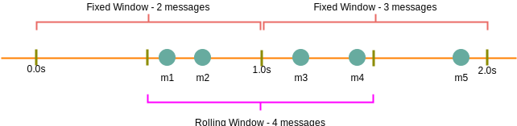
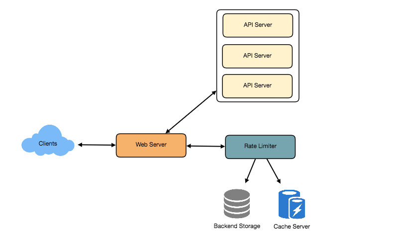
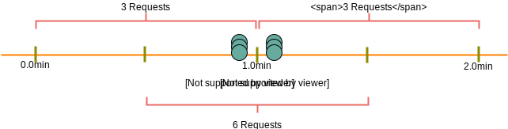

 # Designing an API Rate Limiter

An API reate limiter will throttle users based on the number of requests they are sending.

## Why Rate Limiting?
Rate limiting helps to protect services against abusive behaviors targeting the application such as Denial-of-service (DOS) attacks, brute-force password attempts, brute-force credit card transactions, etc.

We also want to prevent revenue loss, to reduce infrastructure costs, stop spamming and stop online harassment. 

Here's some scenarios that show how benefitial it is to Rate limit our API/Service:

- **Misbehaving clients:** Sometimes, clients can overwhelm servers by sending large number of requests, either intentionally or unintentionally. 

- **Security:** Limiting the number of times a user is allowed to try authenticating with a wrong password.

- **Preventing abusive and bad design practices:** Without API limits, developers of client apps might request the same info over and over again.

- **Revenue:**  Certain services might want to limit operations based on the tier of their customer's service and thus create a revenue model off the rate limiting. To go beyond the set limit, the user has to buy higher limits.

- Prevent spikiness of traffic so that the service stays reliably up for all.


## 1. Requirements and System Goals

#### Functional requirements
1. Limit the number of requests an entity can send to an API within a time window
2. The user should get an error whenever they cross the defined threshold within a single server or across a set of servers.

#### Non-Functional requirements
1. The system should be highly available, always protecting our API service from external attacks.
2. The rate limiter should NOT introduce substantial latencies affecting the user experience.

## 2. Throttling Types

* ***Hard Throttling*** – Number of API requests cannot exceed the throttle limit

* ***Soft Throttling*** – Set the API request limit to exceed by some percentage. E.g, if the rate-limit = 100 messages/minute, and 10% exceed-limit, our rate limiter will allow up to 110 messages per minute

* ***Dynamic Throttling*** – The number of requests can exceed the limit if the system has some free resources available. 

## 3. Algorithms used for Rate Limiting

#### Fixed Window Algorithm
Here, the time window is considered from the start of the time-unit to the end of the time-unit. For instance, a period will be considered 0-60 sec for a minute regardless of the time frame at which the API request has been made.

The diagram below shows that we will only throttle 'm5' message, if our rate limit is 2 messages per second.



#### Rolling Window Algorithm
Here, the time window is considered from the fraction of time at which the request is made plus the time window length.

For example, if our rate limit = 2 msg per sec, the two messages sent at the 300th millisecond (m1) and 400th millisecond (m2), we'll count them as two messages starting from the 300th of that second to the 300th of the next second (making up one second).

In the above diagram, we'll therefore throttle m3, m4.


## 4. High Level Design

Once a new request arrives, the Web server first asks the Rate Limiter to decide if it will be served or throttled. If the request is not throttled, the it's passed to the API servers. 




## 5. Basic System Design and Algorithm

Assume our rate limiter allows 3 requests/sec per user. 

For each unique user, 
- Keep a count representing how many requests the user has made
- and a timestamp when we started counting

We can keep this in a hashtable, where:
```python
#  Key (userID): Value {count, start_time}
hashtable = {
    'userID0': {
        'count': 3, 'start_time': 1574866492
    },
    'userId1': {
        'count': 1, 'start_time': 1574873716
    },
    ...
}
```
When a new request comes in, the rate limiter will perform the following steps:

1. If the `userID` is not present in hash-table, 
    - insert it, 
    - set `count` to 1 and set `start_time` to current epoch time
2. Otherwise, find the existing record of the userID, and 
    - if `current_time - start_time >= 1 min`, set the `start_time` to be the current time, 
    - set `count` to 1 and allow the request
3. If `current_time - start_time <= 1 min` and
    - If `count < 3`, increment the count and allow the request.
    - If `count >= 3`, reject the request.
    
#### Problems with this Fixed Window Algorithm
1. We are resetting the `start_time` at the end of every minute, which means we can potentially allow twice the number of requests per minute.

Imagine if a user sends 3 requests at the last second of a minute, they can immediately send 3 more requests at the very first second of the next minute, resulting in 6 requests in a span of two seconds. The solution for this would be a sliding window algorithm.



2. Atomicity: The read and then write process can create a race condition. Imagine, a given user's current count = 2. If two seperate processes served each of these requests and concurrently read the count before either updated it, each process would erroneously think that the user had one more request to go hit the rate limit. 


#### Solutions
We can use Redis to store our key-value and solve the atomicity problem using [Redis lock](https://redis.io/topics/distlock) for the duration of the read-update operation. 
This however, would slow down concurrent requests from the same user and introduce another layer of complexity.

&nbsp;

#### How much memory to store all the user data?
Assume the userID takes 8 bytes, epoch time needs 4 bytes, 2 bytes for count:
```
8 + 2 + 4 = 14 bytes
```
Let's assume our hash-table has an overhead of 20 bytes for each record. If we need to track 1 million users at any time:
```
Total memory =  (14 + 20) bytes * 1 million => 34 MB memory.
```

If we assume that we need a 4-byte number to lock each user's record to solve the atomicity problems, we would require a total of 38MB memory.

This can fit in a single server. However, wouldn't like to route all traffic in a single machine. Also, if we want to rate limit 10 requests/sec, this would translate to 10 million QPS for our rate limiter. This would be too much to handle for a single server. Practically, we can use Redis or Memcached in a distributed setup. We'll store all the data in the remote Redis servers and all the Rate limiter servers will read/update these servers before serving or throttling any request.


## 6. Slide Window Algorithm

We can maintain a sliding window if we can keep track of each request per user.

We can store the timestamp of each request in a [Redis Sorted Set](https://redis.io/topics/data-types).

```python
hash_table = {
    # userID:   { Sorted Set <unix time> }
    'userID-0': {1574860105, 1574881109, 1574890217 },
    'userID-1': {1574866488, 1574866493, 1574866499}
    ...
}
```
Assume our rate limiter allows 3 requests/sec per user. 

When a new request comes in, the rate limiter will perform the following steps:

1. Remove all timestamps from Sorted Set that are older than `current_time - 1 minute`
2. Count total number of elements in the sorted set. Reject request if the count is greater than our throttling limit of 3.
3. Insert current time in sorted set and accept the request.

#### Memory for storing user data?
Assume UserId takes 8 bytes, each epoch time takes 4 bytes.

Now suppose we need a rate limiting of 500 requests per hour. Assume 20 bytes of overhead for hash-table and 20 bytes for sorted set. 

```
8 + (4 + 20 bytes sorted set overhead) * 500 + 20 bytes hash-table overhead = 12KB
```

If we need to track one million users at any time:
```
Total memory = 12KB * 1 million users =>  12 GB
```

Sliding window takes a lot of memory compared to Fixed window; this would be a scalability issue. What if we can combine the above two algorithms to optimize our memory usage?


## 7. Sliding Window + Counters
What if we keep track of request counts for each user using multiple fixed time windows. 

For example, if rate limit is hourly, keep a count for **each minute** and calculate the sum of all counter in the past hour when we receive a new request.

This reduces our memory footprint. Let's take an example where we rate-limit at 500 requests/hour, with an additional limit of 10 requests/minute. *This means that when the sum of the counters with timestamps in the past hour exceeds the request threshold (500), the user has exceeded the rate limit.*

In addition, the user can't send more than 10 requests per minute. This would be a reasonable and practical consideration, as none of the real users would send frequent requests. Even if they do, they'll see success with retries since their limits get reset every minute.


We can store our counter in a [Redis Hash](https://redis.io/topics/data-types) since it offers very efficient storage for < 100 keys.
Which each request, increment a counter in the hash, it also sets the hash to [expire](https://redis.io/commands/ttl) an hour later. We will normalize each time to a minute.


```
Rate limiting allowing 3 requests per minute for User1

[Allow request] 7:00:00 AM  ---- "User1": {1574860100: 1}
[Allow request] 7:01:05 AM  ---- "User1": { 1574860100: 1, 1574860160: 1}
[Allow request] 7:01:20 AM  ---- "User1": { 1574860100: 1, 1574860160: 2}
[Allow request] 7:01:20 AM  ---- "User1": { 1574860100: 1, 1574860160: 3}
[Reject request] 7:01:45 AM ---- "User1": { 1574860100: 1, 1574860160: 3}
[Allow request] 7:02:20 AM  ---- "User1": { 1574860160: 3, 1574860220: 1}
```

#### How much memory to store all user data?

We'll need: 
```

UserID = 8 bytes
Counter = 2 bytes
Epoch time = 4 bytes

Since we keep a count per minute, at max, we need 60 entries per user
8 + (4 + 2 + 20 Redis-hash overhead) * 60 entries + 20 Hash-table overhead = 1.6KB
```

If we need to track 1 million users at any time:
```

Total memory = 1.6KB * 1 million => 1.6 GB 
(86% less memory than the simple sliding window algorithm)

```


# 8. Data Sharding and Caching
We can shard based on the userID to distribute user data.

For fault tolerance and replication we should use Consistent Hashing. Consistent hashing is a very useful strategy for distributed caching system and DHTs. It allows us to distribute data across a cluster in such a way that will minimize reorganization when nodes are added or removed. 

&nbsp; 

#### Caching
We can get huge benefits from caching recent active users. 

Our app servers can quickly check if the cache has the desired record before hitting backend servers. Our rate limiter can benefit from the **Write-back cache** by updating all counters and timestamps in cache only. The write to the permanent storage can be done at fixed intervals. This way we can ensure minimum latency added to the user's request by the rate limiter. The reads can always hit the cache first; which will be extremely useful once the user has hit the rate limit and the rate limiter will only be reading data without any updates. 

Least Recently Used (LRU) can be a reasonable eviction policy for the our cache.


```python

```
