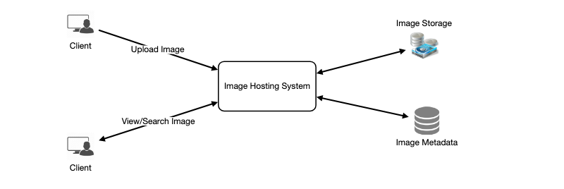
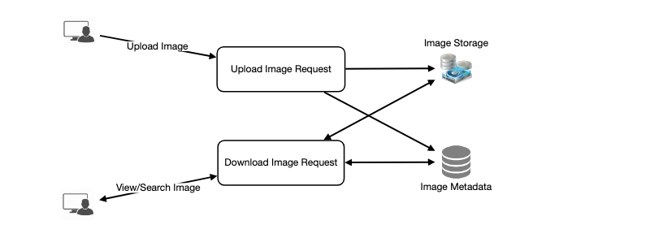
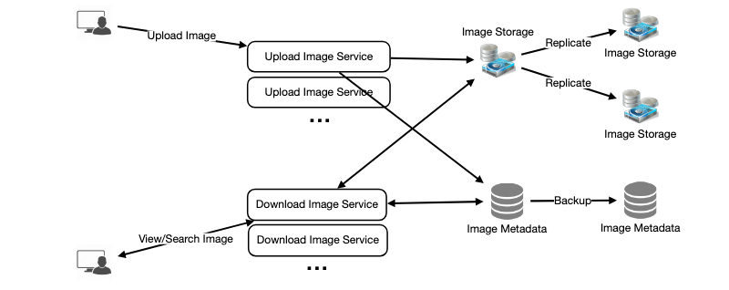

# Designing Instagram

Let's design a photo-sharing service like IG, where users upload photos to share them with other users.

Instagram enables its users to upload and share their photos and videos with other users. Users can choose to share information publicly or privately. Anything shared publicly can be seen by any other user, whereas privately shared content can only be accessed by a specified set of people.

We plan to design a simpler version of Instagram, where a user can share photos and can also follow other users. 

## 1. Requirements and Goals of the System

#### Functional requirements
1. Users should be able to upload/download/view photos
2. Users can perform searches baed on photo/video titles
3. Users can follow other users
4. The system should generate Newsfeed consisting top photos from all the people the user follows

#### Non-functional requirements
1. The service needs to be highly available
2. The acceptable latency is 200ms for News Feed generation
3. The system should be highly reliable; any uploaded photo/video should never be lost.

## 2. Capacity Estimation and Constraints

The system would be read-heavy, so we'll focus on buiding a system that can retrieve photos quickly.

- Assume we have 500M total users, with 1M daily active users.
- 2M new photos every day, 23 new photos per second.
- Average photo file size ~= 200KB
- Total space required for a 1 day of photos => 
    ```
    2M * 200KB => 400GB
    ```
- Total space for 10 years:
    ```
    400GB * 365 days * 10 years ~= 1425 TB => 1.4 Petabytes
    ```

## 3. High Level System Design

At a high-level, we need to support two scenarios: uploading photos and view/searching photos.

We need object storage servers to store photos and also some DB servers to store metadata information about the photos.



## 4. Database Schema

> The DB schema will help understand data flow among various components and later guide us towards data partitioning.

We need to store user data, their photos, and people they follow.

Photo table 

>

| Photo    |            
| --- |             
| PhotoID: int (PK) |     
| UserID: int     |
| PhotoLatitude: int |
| PhotoLongitude: int |
| UserLatitude: int |
| UserLongitude: int |
| CreationDate: datetime |

>

| User |
| --- |
| UserID: int (PK) |
| Name: varchar(20) |
| DOB: datetime |
| CreatedAt: datetime |
| LastLogin: datetime |

>

|UserFollow |  |
|---|---|
| PK | UserID1: int |
| PK | UserID2: int|


We could use an RDBMS like MySQL since we require joins. But relational DB come with their challenges, especially when scaling. So we can store the schema in a distributed wide-column NoSQL datastore like [Cassandra](https://en.wikipedia.org/wiki/Apache_Cassandra).
All the photo metadata can go to a table where the `'key'` is the `PhotoID` and the `'value'` would be an object containing Photo related details.
Cassandra and most key-value stores maintain a certain number of replicas to offer reliability. Also in these data stores, deletes don't get applied instantly, data is retained for a few days to support undeleting, before getting removed permanently.

We can store the actual photos in as distributed file storage system like [Hadoop](https://en.wikipedia.org/wiki/Apache_Hadoop) or [S3](https://en.wikipedia.org/wiki/Amazon_S3).


## 5. Data Size Estimation

Let's estimate how much storage we'll need for the next 10 years.

### User

Assuming each int and datetime is 4 bytes, each row in User table will have:
```
UserID(4 bytes) + Name(20 bytes) + Email(32 bytes) + DOB(4 bytes) + 
CreatedAt(4 bytes) + LastLogin(4 bytes) = 68 bytes
```
We have 500 million users:
```
500 million * 68 bytes ~= 32 GB
```

### Photo

Each row in Photos table will have:
```
PhotoID (4 bytes) + UserID (4 bytes) + PhotoPath (256 bytes) + PhotoLatitude (4 bytes) + PhotoLongitude(4 bytes) + UserLatitude (4 bytes) + UserLongitude (4 bytes) + CreationAt (4 bytes) = 284 bytes
```
We get 2M photos every day, so for one day we need:
```
2 M * 284 bytes ~= 0.5 GB per day

For 10 years we'll need:
0.5GB per day * 365 days * 10 years => 1.88 TB
```

### UserFollow

Each row will have 8 bytes. Assume on average, each user follows 500 users, We would need 1.82 TB of storage for the UserFollow Table:
```
8 bytes * 500 followers * 500M users ~= 1.82 TB
```
Total space required for the DB tables for 10 years will be:
```
32 GB + 1.88 + 1.82  ~= 3.7TB
```

## 6. Component Design

Photo uploads (or writes) can be slow as they have to go to the disk, while reads will be faster, especially if they are being served from cache.

Uploading users can consume all available connections, as uploading is a slow process, meaning reads can't be served if the system gets busy with all the write requests. 

We should keep in mind that all web servers have a connection limit. If we assume that a web server can have a maximum of 500 connections at any time, then it cant have more than 500 concurrent reads and uploads. To handle this bottleneck, we can split reads and writes into seperate services –– dedicated servers for reads and different servers for writes/uploads to ensure they don't hog the system.

> Also, separating reads from writes will allow us to scale and optimize each operation independently.



## 7. Reliability and Redundancy

Losing files is not an option for our service. 

We'll store multiple copies of each file so that if one storage server dies, we can retrieve another copy on a different storage server.

This principle also applies to the rest of the system. If we want high availability, we need to have multiple replicas of services running, so that if a few services go down, the system remains available and running. 

> Redundancy removes the single point of failure in the system, taking control after a failover.

If there are two instances of the same service running on production and one fails, the system can failover to the healthy copy. Failover can happen automatically or be done manually.



## 8. Data Sharding

### a. Partitioning based on UserID

We can shard based on UserID, so that we keep all photos of a user on the same shard. If one DB shard is 1TB, we need 4 shards to store 3.7TB of data. Assume for better performance and scalability, we keep 10 shards.

We'll find the shard number by doing (UserID % 10) and storing the data there. To uniquely identify each photo in the system, we can append shard number to each PhotoID.

**How do we generate PhotoIDs?** Each DB shard can have its own auto-increment sequence for PhotoIDs and since we will append ShardID with each PhotoID, it will make it unique throughout the system.

Issues with this approach:
- How would we handle hot users? IG celebrities have a lot of followers, meaning many people see any photo they upload.
- Some users will have more photos than others, so data will be unevenly distrubuted in the partitions.
- Storying all photos of a user on one shard can cause issues like unavailability if that shard is down, or higher latency if it's serving high loads.


### b. Partitioning based on PhotoID

If we generate unique PhotoIDs first, then find a shard number using
(PhotoID % 10), the above problems will be solved.
We wont need to append ShardID with PhotoID since the PhotoID will itself be unique throughout the system.

**How to generate photoIDs?** We can dedicate a seperate DB instance to generate auto-incrementing IDs. If our PhotoID can fit into 64 bits, we can define a table containing only 64 bit ID field. So whenever we want to add a photo, we can insert a new row in Photo table and take that ID to be the new photo's PhotoID.

**Wouldnt this key generating DB be a single point of failure?**
Yes. 

A workaround for this is to define two such DBs:
- one generates even numbered IDs
- the other generates odd numbered IDs

```
KeyGeneratingServer1:
auto-increment-increment = 2
auto-increment-offset = 1
 
KeyGeneratingServer2:
auto-increment-increment = 2
auto-increment-offset = 2
```
Then, we can put a load balancer in front of both DBs to round robin between them and to deal with downtime.

**Alternatively**, we can have a standalone Key Generation Service (KGS) that generates random six letter strings beforehand and stores them in a database (let’s call it key-DB)

## 9. Ranking and NewsFeed Generation

We need to fetch the latest, most popular photos of the people the user follows.

- First, get a list of people the user follows and fetch metadata info of latest 100 photos for each
- Submit all photos to ranking algorithm which will determine the top 100 photos (based on recency, likeness, etc.)
- Return them to the user as news feed.

To improve the efficiency, we can pre-generate the News Feed and store it in a separate table.

#### **Pre-generating the News Feed**:

- Dedicate servers that continously generate users' News feeds and store them in a **`UserNewsFeed`** table. When any user needs the latest photos, we simply query this table.
- When servers need to generate again, they will first query `UserNewsFeed` table to find last time the News feed was generated. Then, new News Feed data will be generated from that time onwards.

#### **How do we send News Feed content to users?**

**1. Pull**: Clients pull content from server on a regular/ or manually.
Problems:
- New data not showing until client issues a pull request
- Most of the time pull requessts will result in empty response if there's no data. (Frustrating the user)

**2. Push:** Servers push new data to users as soon as it is available. Users maintain a long poll request with the server. A possible problem is, a user who follows a lot of people or a celebrity user who has millions of followers; the server will have to push lots of updates quite frequently, straining the server.

**3. Hybrid:** 
- We can adopt a hybrid of the two approaches. Users with lots of followers will use a pull-based model. We only push data to those users who have < 1000 followers. 
- Server pushes updates to all users not more than a certain frequency, and letting users with a lot of updates to regularly pull data. 


# 10. Cache and Load balancing

Our service will need a massive-scale photo delivery system to serve the globally distributed users.

We'll push content closer to the user using a large number of georgraphically distributed CDNs.

We can also have a cache for metadata servers to cache hot DB rows. Memcache can cache the data and application servers before hitting the actual DB. 
For cache eviction, we can use Least Recently User (LRU), where we discard the least recently viewed rows out of the cache memory.


#### **How can we build a more intelligent cache?** 

If we go with 80-20 rule, 20% of photo reads generates 80% of traffic. This means that certain photos are so popular that the majority of people view/search them. Therefore, we can try caching 20% of daily read volume of photos and metadata. 


```python

```
