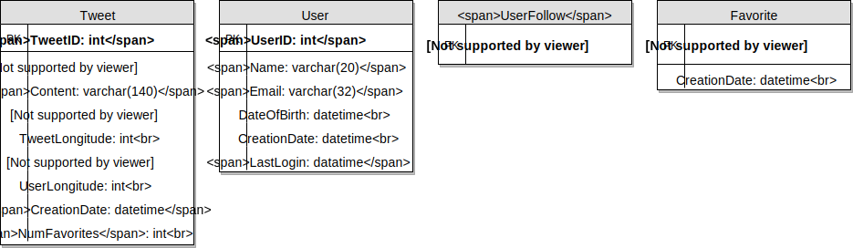
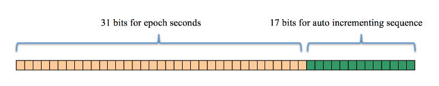

# Designing Twitter

Twitter is an online social networking service where users post and read short 140-character messages called "tweets". Registered Users can post and read tweets, but those not registered can only read them. 


## 1. Requirements and System Goals

### Functional Requirements
1. Users should be able to post new tweets.
2. A user should be able to follow other users.
3. Users should be able to mark tweets as favorites.
4. Tweets can contain photos and videos.
5. A user should have a timeline consting of top tweets from all the people the user follows.

### Non-functional Requirements
1. Our service needs to be highly available.
2. Acceptance latency of the sytstem is 200ms for timeline generation.
3. Consistency can take a hit (in the interest of availability); if user doesn't see a tweet for a while, it should be fine.

### Extended Requirements
1. Searching tweets.
2. Replying to a tweet.
3. Trending topics - current hot topics.
4. Tagging other users.
5. Tweet notification.
6. Suggestions on who to follow.

## Capacity Estimation and Constraints

Let's assume we have 1 billion users, with 200 million daily active users (DAU). 
Also assume we have 100 million new tweets every day, and on average each user follows 200 people.

**How many favorites per day?** If on average, each user favorites 5 tweets per day, we have:
```
200M users * 5 => 1 billion favorites.
```

**How many total tweet-views?** Let's assume on average a user visits their timeline twice a day and visits 5 other people's pages. On each page if a user sees 20 tweets, then the no. of views our system will generate is:
```
200M DAU * ((2 + 5) * 20 tweets) => 28B/day
```

#### Storage Estimates
Let's say each tweet has 140 characters and we need two bytes to store a character without compression. Assume we need 30 bytes to store metadata with each tweet (like ID, timestamps, etc.). Total storage we would need is:
```
100M new daily tweets * ((140 * 2) + 30) bytes => ~28 GB/day
```

Not all tweets will have media, let's assume that on average every fifth tweet has a photo and every tenth a video. Let's also assume on average, a photo = 0.5MB and a video = 5MB. This will lead us to have:
```
    (100M/5 photos * 0.5MB) + (100M/10 videos * 5MB) ~= 60 TB/day
```

#### Bandwidth Estimates
Since total ingress is 60TB per day, then it will translate to: 
```
60TB / (24 * 60 * 60) ~= 690 MB/sec
```
Remember we have 28 billion tweets views in a day. We must show the photo of every tweet, but let's assume that the users watch every 3rd video they see in their timeline. So, total egress will be:

```
      (28Billion * 280 bytes) / 86400 of text ==> 93MB/s
    + (28Billion/5 * 0.5MB) /  86400 of photos ==> ~32GB/s
    + (28Billion/10/3 * 5MB) / 86400 of videos ==> ~54GB/s
    
    Total ~= 85GB/sec
```


## 3. System APIs

We can have a REST API to expose the functionality of our service. 

```python
tweet(
    api_dev_key,     # (string): The API developer key. Use to throttle users based on their allocated quota.
    tweet_data,      # (string): The text of the tweet, typically up to 140 characters.
    tweet_location,  # (string): Optional location (lat, long) this Tweet refers to.
    user_location,   # (string): optional user's location.
    media_ids,       # (optional list of media_ids to associated with the tweet. (all media - photo, videos needs to be uploaded separately)
)
```
Returns: (string)
    A successful post will return the URL to access that tweet. Otherwise, return an appropriate HTTP error.


## 4. High Level System Design
We need a system that can efficiently store all the new tweets, 
i.e
- store `100M/86400sec => 1150 tweets per second` 
- and read `28billion/86400s => 325,000 tweets per second`.

It's clears that from the requirements, the system will be **read-heavy**.

At a high level:
- we need multiple application servers to serve all these requests with load balancers in front of them for traffic distribution. 
- On the backend, we need an efficent datastore that will store all the new tweets and can support huge read numbers. 
- We also need file storage to store photos and videos.

This traffic will be distributed unevenly throughout the day, though, at peak time we expect at leas a few thousand write requests and around 1M read requests per second. 
**We should keep this in mind while designing the architecture of our system.**


## 5. Database Schema
We need to store data about users, their tweets, their favorite tweets, and people they follow.



For choosing between SQL or NoSQL, check out [Designing Instagram](designing_instagram.md)

## 6. Data Sharding

We have a huge number of tweets every day. We need to distribute our data onto multiple machines such that reads/writes are efficient.


#### Sharding based on UserID
We can try storing a user's data on one server. While storing:
- Pass a UserID to our hash function that will map the user to a DB server where we'll store all of their data. (tweets, favorites, follows, etc.)
- While querying for their data, we can ask the hash function where to find it and read it from there. 

Issues:
1. What if a user becomes hot? There will be lots of queries on the server holding that user. This high load will affect the service's performance.
2. Over time, some users will have more data compared to others. Maintaining a uniform distribution of growing data is quite difficult. 

#### Sharding based on TweetID
- Hash function maps each TweetID to a random server where we store that tweet.
- Searching a tweet will query all servers, and each server will return a set of tweets.
- A centralized server will aggregate the results to return them to the user.

**To generate a user's timeline:**
1. App server will find all the people the user follows.
2. App server will send a query to all DB servers to find tweets from these people.
3. Each DB server will find tweets for each user, sort them by recency and return top tweets.
4. App server will merge all results and sort them again to return the top results to the user.

This solves the problem of hot users.

Issues with this approach:
- We have to query all DB partitions to find tweets for a user, leading to higher latencies.

> We can improve the performance by caching hot tweets in front of the DB servers.

#### Sharding based on Tweet creation time

Storing tweets based on creation timestamp will give help us to fetch all top tweets quickly and we only have to query a very small set of servers.

Issues:
- Traffic load won't be distributed. e.g when writing, all new tweets will be going to one server, and remaining servers sit idle. When reading, server holding the latest data will have high load as compared to servers holding old data.

#### Sharding by TweetID + Tweet creation time
Each tweetID should be universally unique and contain a timestamp.
We can use epoch time for this. 

First part of TweetID will be a timestamp, second part an auto-incrementing number. We can then figure out the shard number from this TweetId and store it there.

What could be the size of our TweetID?
If our epoch time started today, the number of bits we need to store the numnber of seconds for the next 50 years:

```
Number of seconds for the next 50 years:
    86400 sec/day * 365 days * 50 years ==> 1.6 billion seconds.

```



We would need 31 bits to store the epoch time.
```
2 ^ 31 ==> ~ 2 billion seconds
```

Since on average we expect 1150 new tweets every second i.e 
   ```
   (100M daily / 86400 seconds) ==> 1150 tweets/sec
   ```
we can allocate 17 bits to store auto incremented sequence. This makes our tweetID 48 bits long. 

Every second, we can store 2^17(130k) new tweets. 
We can reset our auto incrementing sequence every second. For fault tolerance and better performance, we can have two DB serves to generate auto-incrementing keys; one odd numbers and one even numbered keys.

If we assume our current epoch seconds begins now, TweetIDs will look like this:


```python
from datetime import datetime
epoch = int(datetime.now().timestamp())

print('epoch - autoincrement')
for i in range(1,5):
    print(f'{epoch}-{i:06}')
```

    epoch - autoincrement
    1571691220-000001
    1571691220-000002
    1571691220-000003
    1571691220-000004


If we make our TweetID 64bits (8 bytes) long, we can easily store tweets for the next 100 years. 

In the approach above, we still have to query all servers for timeline generation, but the reads/writes will be substancially quicker.

- Since we don't have any secondary index (on creation time) this will reduce write latency.
- While reading, we don't need to filter on creatiion-time as our primary key has epoch time included in it.

## 7. Caching

We can have a cache for DB servers to cache hot tweets and users.
Memcache can be used here to store the whole tweet objects.

> Application servers before hitting the DB, can quickly check if the cache has desired tweets.

#### Cache replacement policy
When cache is full, we want to replace a tweet with a newer/hotter tweet. Least Recently Used(LRU) policy can be used to discard the least recently viewed tweet first.

#### Intelligent caching?
If we go with the 80-20 rule, 20% of tweets generating 80% of read traffic, meaning certain tweets are so popular that a majority of people read them. Therefore, we can try to cache 20% of daily read volume from each shard.

#### Caching latest data?
Let's say if 80% of our users see tweets from the last 3 days only, we can cache all tweets from past 3 days. 

We are getting 100M tweets  or 30GB of new data every day(without photos or videos). If we want to store all the tweets from last 3 days, we will need 100GB of memory. This data can easily fit into one cache server, but we should replicate it onto multiple servers to distribute all the read traffic to reduce the load on cache servers. 

Whenever we are generating a user's timeline, we can ask the cache servers if they have all the recent tweets for that user, If yes, we can simply return all the data from the cache. If we don't have enough, we have to query backend server to fetch the data. We can also cache photos/videos from the last 3 days.

### Cache structure
Our cache would be a hash table. 
- Key would be `OwnerID` and value would be a doubly linked list containing all tweets from that user in the past 3 days.
- Since we retrieve the most recent tweets first, we can insert new tweets at the head of linked list.
- Older tweets will be at the tail of the linked list. 
- We can remove tweets from the tail to make space for newer tweets


## 8. Load Balancing
We can add Load balancing layer at 3 places:
1. Between clients and application servers
2. Between app servers and DB replication servers
3. Between Aggregation servers and Cache servers

We can adopt a simple round robin approach to distribure incoming requests equally among servers.
Benefits of this LB approach:
- Simple to implement with no overhead
- If a server is dead, LB will take it our for the rotation and will stop sending any traffic to it.

Problem with Round Robin is that it doesn't know if a server is overloaded with requests or slow. It won't stop sending requests to that server. To fix this, a moe intelligent LB solution can be placed that periodically queries backend server about their load and adjusts traffic to it based on that. 

## 9. Extended Requirements

**Trending Topics:** We can cache most frequently occuring hashtags or search queries in the last N seconds and update them after every M seconds. We can rank trending topics based on like frequency, number of retweets, etc.

**Suggestions on who to follow:** We can suggest friends of people someone follows. Wecan go two or three degrees of separation down to find famous people for the suggestions. Give preference to people with more followers.

We can use Machine Learning to offer suggestions based on reoccuring patterns like, common followers if the person is following this user, common location or interests, etc.

**How do we serve feeds:** We can pre-generate the feed to improve efficiency; for details see [Ranking and time generation under Designing Instagram](designing_instagram.md)


## 10. Monitoring
We should constantly collect data to get an insight into how our system is doing. We can collect:
- New tweets per day/second. 
- What time the daily peak is.
- Timeline delivery stats, how many tweets per second our service is delivering.
- Average latency that is seen by the user to refresh their timeline.

By monitoring these, we will realize if we need more replication, load balancing or caching.

## 11. Availability
Since our system is read-heavy, we can have multiple secondary database servers for each DB partition. Seconday servers will be used for read traffic only. All writes will first go to the primary server and then will be replicated to secondary servers. This also implements fault tolerance, since whenever the primary server goes down, we can failover to a secondary server.
