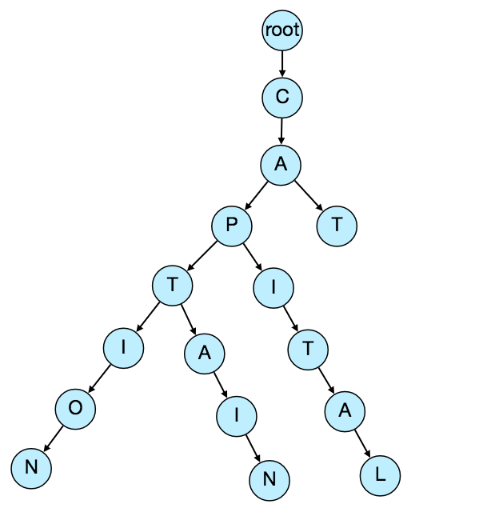
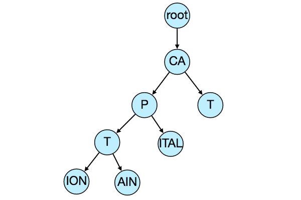
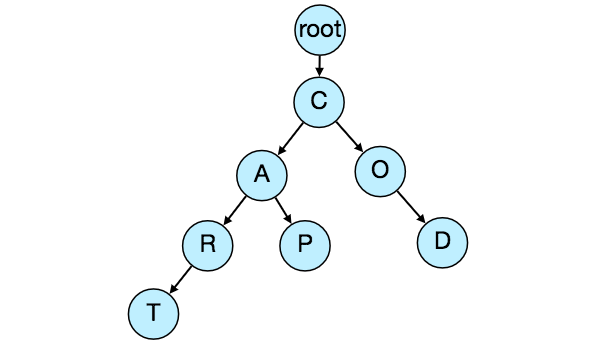

# Designing Typeahead Suggestion

Typeahead is a real-time suggestion service which recommends terms to users as they enter text for searching.

As the user types into the search box, it tries to predict the query based on the characters the users has entered, and gives a list of suggestions to complete the query.

It's not about speeding up the users' search but to help the user articulate their search queries better.


## 1. Requirements and Goals of the System
**Functional requirements:** As the user types in their search query, our service should suggest top 10 terms starting with whatever the user typed.

**Non-functional requirements:** The suggestions should appear in real-time, allowing the user to see it in about 200ms.


## 2. Basic System Design and Algorithm

The problem to solve is that we have a lot of strings we need to store in such a way that the user can search with any prefix. The service will suggest the terms that match with the prefix. For example, if our DB contains the terms (cat, cap, captain, capital), and the user has typed in `cap`, then the system should suggest `cap`, `captain` and `capital`.

To serve a lot of queries with minimal latency, we can't depend on the DB for this; we need to store our index in memory in a highly efficient data structure – a Trie(pronounced "try").



If the user types `cap`, then the service can traverse the trie and go to the node **P**, to find all the terms that start with this prefix. (i.e cap-ital, cap-tain, cap-tion).

We can also merge nodes that have only one branch to save memory.




**Should we have a case insensitive trie?** For simplicity, lets assume our data is case insensitive.

#### How do we find top 10 suggestions?
We can store the count of searches that terminated at each node. For example, if the user about `captain` 20 times, and `caption` 50 times, we can store the count with the last character of the phrase. Now if the user types `cap` we know that the top most searched word under 'cap' is `caption`.

> So to find the top suggestions for a given prefix, we can traverse the sub-tree under it.

&nbsp;

#### Given a prefix, how long will it take to traverse its sub-tree?
Given the amounf of text we need to index, we should expect a huge tree. Traversing a tree will take really long. Since we have strict latency requrements, we need to improve the efficiency of our solution.
- Store top 10 suggestions for each node. This will require extra storage.
- We can optimize our storage by storing only references to the terminal node rather than storing the entire phrase. 
- Store frequency with each reference to keep track of top suggestions.

&nbsp;

#### How do we build this trie?
We can efficiently build it bottom-up. 
- Each parent node will recursively call child nodes to calculate top suggestions and their counts.
- The parent nodes will combine their suggestions from all their children nodes to determine their top suggestions.

&nbsp;

#### how do we update the trie?
Assume 5 billion daily searches
```
5B searches / 36400 sec a day ~= 60K searches/sec
```
Updating the trie for every search will be extremely resource intensive and this can hamper our read requests too.
Solution: Update the trie offline at certain intervals.

As new queries come in, log them and track their frequency of occurences. We can log every 1000th query. For example, if we don't want to show a term that hasn't been searched for < 1000 times, it's safe to only log queries that occur the 1000th time.

We can user [Map Reduce (MR)](https://en.wikipedia.org/wiki/MapReduce) to process all the logging data periodically, say every hour. 
- The MR jobs will calculate the frequencies of all search terms in the past hour.
- Then update the trie with the new data. We take the current snapshot of the trie and update it offline with the new terms and their frequencies.

We have two options to updating offline:
1. Make a copy of the trie from each server and update the copy offline. Once done, switch to the copy and discard the old one.
2. Master-slave configure each trie server. Update slave while master is service incoming traffic. Once update is complete, make our slave the new master. Then later, update our old master, which can then start serving traffic too.

&nbsp;

#### **How do we update the frequencies of suggestions?**
We are storing frequencies of suggestions for each node, so we need to update them too.

We can update only differences in frequencies, instead of recounting all search terms from scratch.

Approach: Use **[Exponential Moving Average(EMA)](https://en.wikipedia.org/wiki/Moving_average#Exponential_moving_average)**
- This will allow us to give more weight to the latest data. 
- This means that: if we keep count for searches done the last 10 days, we need to subtract the count from the time period *no longer included* and add counts for the new time period included.

&nbsp;
**Inserting a new term and updating corresponding frequencies**

After inserting a new term in the trie, we will go to the term's terminal node and increase its frequency. 
Since we are storing top 10 suggestions for a node, it's possible that the new term is also in the top 10 suggestions of a few other nodes.
We'll therefore update the top 10 queries of those nodes too. 

Traverse back from the node all the way to the root. For each parent, we check if the new query is part of the top 10. If so, we update the corresponding frequency. If not, we check if the current query's frequency is high enough to be top 10. If so, we insert the new term and remove the term with the lowest frequency.

&nbsp;

#### **How do we remove a term from the trie?**

Let's say we have to remove some term because it's highly offensive or for some legal issue.
We can do that when the periodic updates happen. Meanwhile, we can also add a filtering layer on each server which will remove any such term before sending them to users.


&nbsp;

#### **What could be different ranking criteria for suggestions?**
In addition to a simple count for ranking terms, we can use factors such as user's location, freshness, language, demographics, personal history, etc.  

## 3. Permanent Storage of the Trie

#### **How to store a trie in a file to rebuild it easily.**
We enables us to rebuild a trie if the server goes down. To store, start with the root node, and save the trie level-by-level. With each node, store the character it contains and how many children it has. Right after each node, we should put all its children. 

Let's assume we have the following trie:



With the mentioned storage scheme, we can store the above trie as:
```
C2,A2,R1,T,P,O1,D
```
From this, we can easily rebuild the trie.

## 4. Capacity Estimation

Since there will be a lot of duplicates in 5 billion queries, we can assume that only 20% of these will be unique. 
Let's assume we have 100 million unique queries on which we want to build an index.

#### Storage Estimates
Assume: average query = 3 words, each averaging 5 characters, then average query size = 15 characters. 

```
Each character = 2 bytes
We need 30 bytes to store each query.

100 million * 30 bytes => 3 GB

```
We can expect this data to grow everyday, but we are also removing terms that are not being searched anymore.
If we assume we have 2% unique new queries every day, total storage for a year is:
```
3GB + ( 3GB * 0.02% * 365 days) ==> 25GB

```

## 5. Data Partition
Although the index can fit in a single server, we still need to partition to meet our requirement of low latency and higher efficiency.

#### Partition based on maximum memory capacity of the server
We can store data on a server as long as it has memory available.
Whenever a sub-tree cannot fit in a server, we break our partition there and assign that range to this server.
We then move on to the next server and repeat the process. 
If Server 1 stored `A to AABC`, then Server 2 will store `AABD` onwards. If our second server could store up to `BXA`, the next server will start from `BXB`, and so on. 

```
Server 1: A-AABC
Server 2, AABD-BXA
Server 3, BXB-CDA
... 
Serve N, ...
```
For queries, if a user types `A`, we query Server 1 and 2 to find top suggestions. If they type `AAA` we only query Server 1.

#### Load Balancing
We can have a LB to store the above mappings and redirect traffic accordingly.


## 6. Cache

Caching the top searched terms will be extremely helpful in our service. 

> There will be a small percentage of queries (20/80 rule) that will be responsible for most of the traffic. 

We can have separate cache servers in front of the trie servers holding most frequently searched terms and their typeahead suggestions. Application servers should check these cache servers before hitting the trie servers to see if they have the desired searched terms. This will save us time to traverse the trie.

We can also build a Machine Learning (ML) model that can try to predict the engagement on each suggestion based on simple counting, personalization, or trending data, and cache these terms beforehand.


## 7. The Client
1. The client should only try hitting the server if the user has not pressed any key for 50ms.
2. If the user is constantly typing, the client can cancel the in-progress request.
3. The client can wait first until the user enters a couple of characters, say 3.
4. Client can pre-fetch data from server to save future requests.
5. Client can store recent history locally, because of the high probability of being reused.
6. The server can push some part of their cache to a CDN for efficiency.
7. The client should establishe the connection to the server fast, as soon as the user opens up the search bar. So that when the user types the first letter, the client doesn't waste time trying to connect at this point.

## 8. Replication and Fault Tolerance.
We should have replicas for our trie servers both for load balancing and also for fault tolerance.
When a trie server goes down, we already have a Master-Slave configuration. So if the master dies, the slave can take over after failover. Any server that comes back up can rebuild the trie from the last snapshot.


## 9. Personalization
Users will receive some typeahead suggestions based on their historical searches, location, language, etc. We can store the personal history of each user separately on the server and also cache them on the client. The server can add these personalized terms in the final set before sending it to the user. Personalized searches should always come before others.
