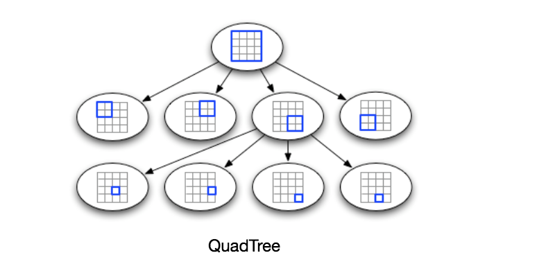

# Designing Uber Backend
Let's design a ride-sharing service like Uber, connecting a passenger who needs a ride with a driver who has a car.

Uber enables its customers to book drivers for taxi rides. Uber drivers use their cars to driver customers around. Both customers and drivers communicate with each other through their smartphones using the Uber app.

Similar Services: Lyft

## 1. Requirements and Goals of the System

There are two types of users in our system: Drivers and Customers.

- Drivers need to regularly notify the service about their current location and their availability to pick passengers
- Passengers get to see all the nearby available drivers
- Customers can request a ride; this notifies nearby drivers that a customer is ready to be picked up
- Once a driver and a customer accept a ride, they acan constantly see each other's current location until the trip finishes.
- Upon reaching the destination, the driver marks the journey complete to be available for the next ride.


## 2. Capacity Estimation and Constraints
- Assume we have 300 million customers and 1 million daily active customers, and 500K daily active drivers.
- Assume 1 million daily rides
- Let's assume that all active drivers notify their current location every 3 seconds.
- Once a customer puts in a request for a ride, the system should be able to contact drivers in real-time.

## 3. Basic System Design and Algorithm


### a. Grids
We can divide the whole city map into smaller grids to group driver locations into smaller sets. Each grid will store all the drivers locations under a specific range of longitude and latitude.
This will enable us to query only a few grids to find nearby drivers. Based on a customer's location, we can find all neighbouring grids and then query these grids to find nearby drivers.

#### What could be a reasonable grid size?
Let's assume that GridID (say, a 4 byte number) would uniquely identify grids in our system.

Grid size could be equal to the distance we want to query since we also want to reduce the number of grids. We can search within the customer's grid which contains their location and the neighbouring eight grids. Since our grids will be statically defined, (from the fixed grid size), we can easily find the grid number of any driver (lat, long) and its neighbouring grids.

In the DB, we can store the GridID with each location and have an index on it, too, for faster searching. 


### b. Dynamic size Grids
Let's assume we don't want to have more than 100 drivers locations in a grid so that we can have faster searching. So, whenever a grid reaches this limit, we break it down into four grids of equal size, and distribute drivers among them (of course according to the driver's current location). This means that the city center will have a lot of grids, whereas the outskirts of the city will have large grids with few drivers.

#### What data structure can hold this information?
A tree in which each node has 4 children.
Each node will represent a grid and will contain info about all the drivers' locations in that grid. If a node reaches our limit of 500 places, we will break it down to create 4 child nodes under it and distribute driver locations among them. In this way, all the leaf nodes will represent grids that can't be broken further down. So leaf nodes will keep a list of places with them.
This tree structure is called a [QuadTree](https://en.wikipedia.org/wiki/Quadtree).



#### How do we build a quad tree?
We'll start with one node that represents the whole city in one grid. Each Uber-available city will have it's own qaud tree.
Since it will have more than 100 locations, we will break it down into 4 nodes and distribute locations among them. We will keep repeating the process with each child node until there are no nodes left with more than 100 driver locations.

#### How will we find the grid for a given location?
We start with the root node(city) and search downward to find one required node/grid. At each step we will see if the current node we are visiting has children. If it has, we move to the child node that ocntains our desired location and repeat the process. We stop only if the node does not have any children, meaning that's our desired node(grid).

#### How will we find neighboring grids of a given grid?
**Approach 1:** Since our leaf nodes contain a list of locations, we can connect all leaf nodes with a doubly linked list. This way we can iterate forward or backwards among neighbouring lead nodes to find out our desired driver locations.

**Approach 2:** Find it through parent nodes. We can keep a pointer in each node to access its parent, and since each parent node has pointers to all its children, we can easily find siblings of a node. We can keep expanding our seach for neighboring grids by going up through parent pointers.

Issues with our Dynamic Grid solution:

* Since all active drivers are reporting their locations every 3 seconds, we need to update the QuadTree to reflect that. It will take a lot of time and resources if we have to update it for every change in the driver's coordinates.
* If the new position does not belong in the current grid, we have to remove the driver from the current grid and remove/reinsert the user to the correct grid. After this move, if the new grid reaches the maximum limit of drivers, we have to repartition it.
* We need to have a quick mechanism to propagate the current location of all nearby drivers to any active customer in that area. Also, when a ride is in progress, our system needs to notify both the driver and passenger about the current location of the car.

> Although our QuadTree helps us find nearby drivers quickly, a fast update in the tree is not guaranteed.

#### Do we need to modify our QuadTree every time a driver reports their location? 
If we dont, it will have some old data and this won't reflect the current location of drivers correctly. Since all active drivers report their location every 3 seconds, there will be a lot more updates happening to our tree than querying for nearby drivers.

Enter hash table!

> We can keep the latest position reported by all drivers in a hash table and update our QuadTree a little less frequently. 

Let's assume we guarantee that a driver's current location will be reflected in the QuadTree within 15 seconds. Meanwhile we will maintain a hash table that will store the current location reported by drivers; let's call this **DriverLocationHT**.

#### How much memory do we need for DriverLocationHT? 
We need to store DriverID, their present and old location, in the hash table. So we need a total of 35 bytes to store one record.

1. DriverID (3 bytes - 1 million drivers)
2. Old latitude  (8 bytes)
3. Old longitude (8 bytes)
4. New latitude  (8 bytes)
5 New longitube  (8 bytes) Total ==> 35 bytes

If we have one million drivers, we need:

```
1 million * 35 bytes ==> 35MB (ignoring hash table overhead)
```

#### How much Bandwidth?
To receive location updates from all active drivers, we get DriverID and their location (3 + 16 bytes => 19 bytes). We do this every 3 seconds from 500 active drivers:
```
19 bytes * 500K drivers ==> 9.5MB per 3 sec.
```

### Do we need to distribute DriverLocationHT Hash Table onto multiple servers?
The memory and bandwidth requirements can be easily handled by one server, but for scalability, performance, and fault tolerance, we should distribute DriverLocationHT onto multiple servers. We can distribute beased the DriverID to make the distribution completely random. Let's call the machines holding DriverlocationHt the Driver location servers.

The servers will:
1. As soon as they receive driver location update, broadcast that information to all interested customers.
2. Notify the respective QuadTree server to refresh the driver's location. This happens every 15 seconds.


### Broadcasting driver's location to customers
We can have a **Push Model** where the server pushes all the positions to all the relevant customers. 
- A dedicated Notification Service that can broadcast current locations of drivers to all the interested customers. 
- Build our Notification service on a publisher/subscriber model. When a customer opens Uber app, they query the server to find nearby drivers. On the back-end, before returning the list of drivers to the customer, we subscribe the customer for all the updates from those nearby drivers.
- We can maintain a list of customers interested in knowing the driver location and whernever we have an update in DriverLocationHT for that driver, we can broadcast the current location of the driver to all subscribed customers. This way, our system ensures that we always show the driver's current position to the customer.

#### Memory needed to store customer subscriptions
Assume 5 customers subscribe to 1 driver. Let's assume we store this information in a hash table to update it efficiently. We need to store driver and customer IDs to maintain subscriptions.

Assume we need 3 bytes for DriverID, 8 bytes for CustomerID:
```
(500K drivers * 3 bytes) + (500K * 5 customers * 8 bytes) ~= 21MB
```

#### How much bandwidth will we need for the broadcast?
For every active driver, we have 5 subscribing customers, so the total subscribers are:
```
5 * 500K => 2.5M
```
To all these customers, we need to send DriverID(3 bytes) + Location(16 bytes) every second, so we need the following bandwidth:
```
(3 + 16) bytes * 2.5M ==> 47.5 MB/s
```

#### How can we efficiently implement Notification Service?
We can use either HTTP long polling or push notifications.


#### How about Clients pull nearby driver information from server?
- Clients can send their current location, and the server will find all the nearby drivers from the QuadTree to return them to the client. 
- Upon receiving this information, the client can update their screen to reflect current positions of drivers. 
- Clients will query every five seconds to limit the number of round trips to the server.
- This solution looks simpler compared to the push model described above.


#### Do we need to repartition a grid as soon as it reaches maximum limit?
We can have a grid shrink/grow an extra 10% before we partition/merge them. This will decrease the load for a grid partition or merge on high traffic grids.


###  "Requesting a Ride" use case
1. The customer will put a request for a ride
2. One of the Aggregator servers will take the request and asks QuadTree servers to return nearby drivers.
3. The Aggregator server collects all the results and sorts them by ratings.
4. The Aggregator server will send a notification to the top (say three) drivers simultaneously, whichever driver accepts the request first will be assigned the ride. The other drivers will receive a cancellation request.
5. If none of the three drivers respond, the Aggregator will request a ride from the next three drivers from the list.
6. The customer is notified once the driver accepts a request.

## 4. Fault Tolerance and Replication

#### What if a Driver Location server or Notification server dies?
We need replicas of these servers,so that the primary can failover to the secondary server. Also we can store data in some persistent storage like SSDs that provide fast IOs; this ensures that if both primary and secondary servers die, we can recover the data from persistent storage.

## 5. Ranking Drivers
We can rank search results not just by proximity but also by popularity or relevance.


#### How can we return top rated drivers within a given radius?
Let's assume we keep track of the overall ratings in our database and QuadTree. An aggregated number can represent this popularirt in our system. 

For example, while searching for the top 10 drivers within a given radius, we can ask each partition of QuadTree to return the top 10 drivers with a maximum rating. The aggregator server can then determine the top 10 drivers among all drivers returned.


```python

```
